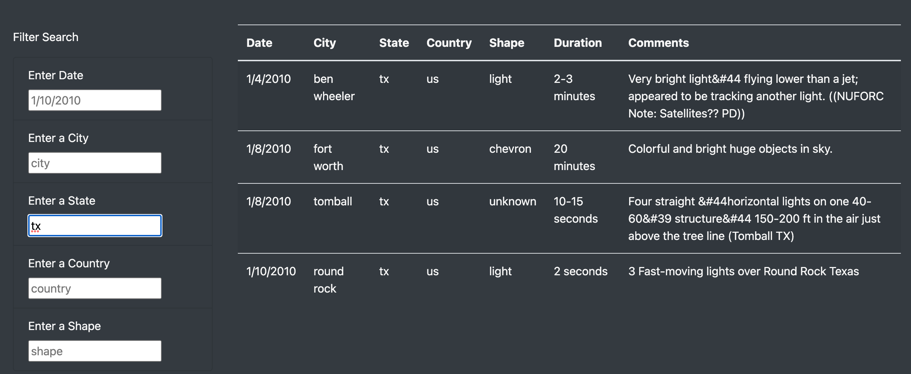
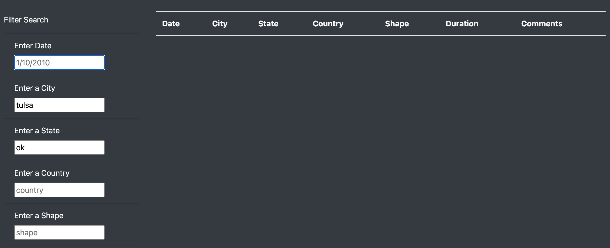

# UFOs
## Overview of Project
The purpose of this project is to use JavaScript and HTML to create a table for data on a webpage as well as several filters to display the information the user is looking for.

## Results
To use this webpage, a user would simply need to enter information into any of the fields to the left of the table, hit the Enter/Return key and the table will be populated with data on the information entered. If the information entered into the filter does not match any information in the dataset, the resulting table will be blank. The user may also enter information into one or multiple filter fields to yield table results. The user should note that they can only enter the information in lower case letters (exactly as it appears in the dataset) in order for the information to show in the table. 

Example: Only one state is entered into the field - resulting in all UFO sightings from that state

Example: Enter same information as the above table in uppercase - yields an empty table

Example: Enter multiple information into multiple fields

Example: Enter data into the field that is not in the dataset yields an empty table

## Summary

Overview of Project: Explain the purpose of this analysis.
Results: Describe to Dana how someone might use the new webpage by walking her through the process of using the search criteria. Use images of your webpage during the filtering process to support your explanation.
Summary: In a summary statement, describe one drawback of this new design and two recommendations for further development.