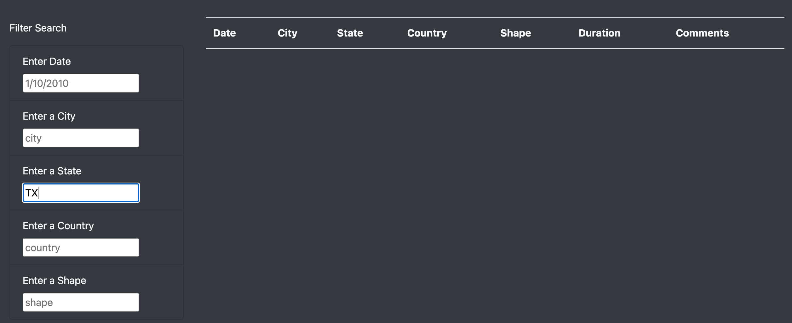

# UFOs
## Overview of Project
The purpose of this project is to use JavaScript and HTML to create a table for data on a webpage as well as several filters to display the information the user is looking for.

## Results
To use this webpage, a user would simply need to enter information into any of the fields to the left of the table, hit the Enter/Return key and the table will be populated with data on the information entered. If the information entered into the filter does not match any information in the dataset, the resulting table will be blank. The user may also enter information into one or multiple filter fields to yield table results. The user should note that they can only enter the information in lower case letters (exactly as it appears in the dataset) in order for the information to show in the table. 

Example: Only one state is entered into the field - resulting in all UFO sightings from that state:

Example: Enter same information as the above table *but this time* in uppercase - yields an empty table:

Example: Enter information into **multiple** fields:

Example: Enter data into the field that is **not** in the dataset yields an empty table:

## Summary
### Drawbacks of Design
The new webpage filter, while expanding the users ability to search the dataset, also has some additional pitfalls. As mentioned above, the user must enter the information into the filter fields ***EXACTLY*** as it appears in the dataset, otherwise the table will yield no results. 

### Recommendations for Further Development
The first recommendation for improving the webpage would be to adjust the filter to accept near exact entries. For example, the filter should be able to accept "CA" in the state filter, and produce results with "ca" as the state. 

Another recommendation for developing the webpage would be to add two buttons to run the filter. One button would run the filter exactly as it runs now - showing the table with only data from exactly what was entered. The other button would run the filter and show all UFO sightings from that match any of the information entered into the filter.